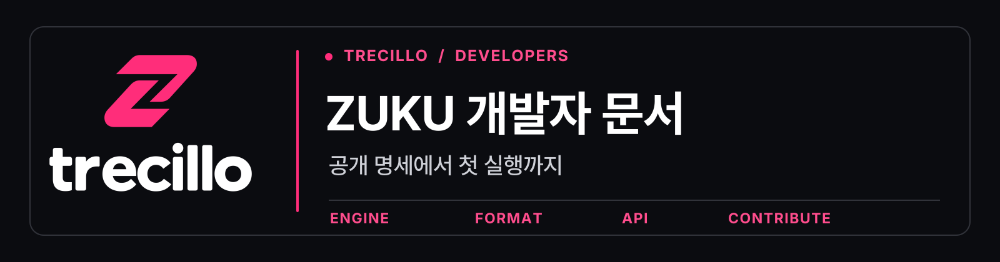

  

# zukuapp 개발 문서와 공통 안내

이 저장소의 [`profile/README.md`](profile/README.md)는 [zukuapp 조직 홈](https://github.com/zukuapp)에 표시됩니다. [공식 개발자 사이트](https://zukuapp.github.io/)와 [렌더링되는 문서 허브](https://zukuapp.github.io/docs/)로 연결하고, 공통 기여 안내를 관리합니다. **Trecillo**가 공식 영문 표기입니다.

## 문서 찾기

| 경로 | 내용 |
| --- | --- |
| [조직 프로필](profile/README.md) | 개발자를 위한 첫 화면과 주요 계약 링크 |
| [공식 개발 문서 사이트](https://zukuapp.github.io/docs/) | 브라우저에서 읽는 입문·저장소 상태·공개 명세 |
| [개발 문서 목차](docs/README.md) | 입문, 저장소 지도, 아키텍처, 브랜드 원칙 |
| [ZWF2로 시작하기](docs/getting-started.md) | 공개 도구를 로컬에서 실행하는 검증 가능한 예제 |
| [저장소 지도](docs/repository-map.md) | 공개 저장소별 역할과 기준 문서 |
| [공개 아키텍처](docs/architecture.md) | 파일 형식과 실행 경계 |
| [브랜드·타이포그래피](docs/brand.md) | 현행 Trecillo 로고 출처와 글꼴 적용 범위 |

## 조직 공통 파일

[`CONTRIBUTING.md`](CONTRIBUTING.md), [`SECURITY.md`](SECURITY.md), [`SUPPORT.md`](SUPPORT.md), [Issue 양식](.github/ISSUE_TEMPLATE), [Pull Request 양식](.github/PULL_REQUEST_TEMPLATE.md)은 각 저장소에 자체 파일이 없을 때 GitHub가 기본 안내로 사용합니다. **저장소별 규칙과 실행 절차가 우선**합니다.

## 이 저장소를 수정할 때

1. 기능과 계약의 사실 관계는 해당 공개 저장소의 README·명세·테스트에서 확인합니다. 공개되지 않은 문서나 배포되지 않은 패키지를 입문 경로로 안내하지 않습니다. `zuku-cli`의 미구현 명령을 실제 작업으로 소개하지 않습니다.
2. 조직 홈의 문구와 링크는 [`profile/README.md`](profile/README.md)를 수정합니다. 웹 문서는 [`zukuapp.github.io/docs/`](https://github.com/zukuapp/zukuapp.github.io/tree/main/docs), GitHub 문서는 [`docs/`](docs/README.md)에 두고 저장소별 상세 사용법은 소유 저장소로 연결합니다.
3. 현행 로고와 배너를 바꿀 때는 [브랜드·타이포그래피 안내](docs/brand.md)의 출처와 생성 절차를 따릅니다.
4. 상대 링크, 이미지, 예제 명령을 확인한 뒤 Pull Request에 검증 결과를 적습니다.

Trecillo · Crevision · [trecillo.crevision.kr](https://trecillo.crevision.kr) · [contact@crevision.kr](mailto:contact@crevision.kr)
