

  
  

  
  
  &nbsp;&nbsp;
  
  
  &nbsp;&nbsp;
  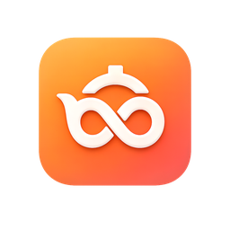

  
  
  
  

  

**ZUKU(즈쿠)** 는 **Crevision** 그룹의 서울 기술 회사 **Trecillo(트레실로)** 가 만드는 창작 미디어 플랫폼입니다.  
보고, 넘기고, 직접 플레이하는 일이 하나의 계정으로 이어집니다.

공식 영문 표기는 **Trecillo** 입니다. 예전 문서에는 Tresillo로 적힌 경우가 있습니다.

문의: [contact@crevision.kr](mailto:contact@crevision.kr)

## 무엇을 만드나요

제품 이름은 어디서나 **Thread · Hype · Swipe · Jump · Vive · Vine · Aist** 입니다. 카드를 누르면 해당 서비스로 이동합니다.

  <a href="https://www.zuzunza.com">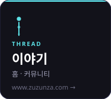</a>
  <a href="https://hype.zuzunza.com">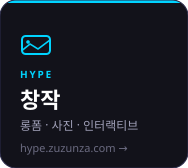</a>
  <a href="https://swipe.zuzunza.com">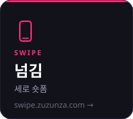</a>
  <a href="https://jump.zuzunza.com">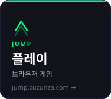</a>

  <a href="https://vive.zuzunza.com">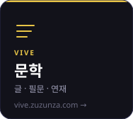</a>
  <a href="https://vine.zuzunza.com">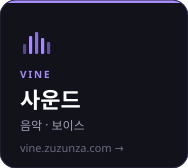</a>
  <a href="https://aist.zuzunza.com">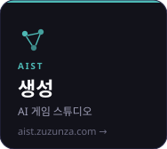</a>

**Thread**는 홈입니다. **Hype · Swipe · Jump**는 앱의 기본 화면이고, **Vive**와 **Vine**은 이어서 들어가는 입구입니다. **Aist**는 게임을 만드는 웹 스튜디오입니다. **Hype**와 **Swipe**도 각각 스튜디오에서 올립니다.

## 어떻게 시작하나요

아래를 열어 다음 행동을 고르세요.

<strong>플레이</strong> — 보고, 넘기고, 바로 하기

 

- [Thread](https://www.zuzunza.com)에서 이야기를 읽고, 다른 작품의 짧은 미리보기를 봅니다.
- [Hype](https://hype.zuzunza.com)와 [Swipe](https://swipe.zuzunza.com)에서 창작 피드를 봅니다.
- 게임 본편은 [Jump](https://jump.zuzunza.com)에서 플레이합니다.

<strong>창작</strong> — 형식에 맞춰 올리기

 

| 만들고 싶은 것 | 가는 곳 |
|---|---|
| 가로 영상 · 사진 · 인터랙티브 | [Hype](https://hype.zuzunza.com) 스튜디오 |
| 세로 숏폼 | [Swipe](https://swipe.zuzunza.com) 스튜디오. Swipe 작품은 Hype로 옮기지 않습니다. |
| 글 · 문학 | [Vive](https://vive.zuzunza.com). Thread 미리보기는 작성자가 켭니다. |
| 음악 · 보이스 | [Vine](https://vine.zuzunza.com) |
| AI로 게임 만들기 | [Aist](https://aist.zuzunza.com)에서 만든 뒤 Jump Studio로 넘깁니다. |

<strong>게임</strong> — Jump에 올리기

 

브라우저에서 바로 실행되는 게임을 만듭니다.

- 엔진: [`zuku-engine-next2d`](https://github.com/zukuapp/zuku-engine-next2d)
- 패키지 도구: [`zuku-cli`](https://github.com/zukuapp/zuku-cli)
- 공개 API: [`zuku-api`](https://github.com/zukuapp/zuku-api)
- 저작 도구: [`zukbox`](https://github.com/zukuapp/zukbox) · 플레이어 [`zukbox-player`](https://github.com/zukuapp/zukbox-player)

공개는 [Jump Studio](https://jump.zuzunza.com)에서, 플레이는 Jump에서 합니다.

<strong>오픈소스</strong> — 공개 도구에 손대기

 

아래 저장소에 이슈를 열거나 변경을 제안해 주세요.

- 조직 이슈: [zukuapp open issues](https://github.com/search?q=org%3Azukuapp+is%3Aissue+is%3Aopen&type=issues)
- 표기: **ZUKU / zuku / 즈쿠**. “시즈쿠”는 쓰지 않습니다.
- 게임 실행의 핵심 구현은 공개하지 않습니다. 이 페이지에는 제품과 공개 도구만 적습니다.

<strong>회사</strong> — Trecillo와 이야기하기

 

- 기업 사이트: [zukuapp.github.io](https://zukuapp.github.io/)
- 서비스: [zuzunza.com](https://zuzunza.com)
- 그룹: Crevision
- 메일: [contact@crevision.kr](mailto:contact@crevision.kr)
- Seoul, Korea

  

## 공개 도구

클릭하면 해당 저장소로 이동합니다.

  
  <a href="https://github.com/zukuapp/zuku-cli">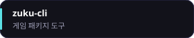</a>
  
  

  
  <a href="https://github.com/zukuapp/zukbox-runtime">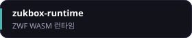</a>
  <a href="https://github.com/zukuapp/shizuku">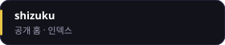</a>
  

## 실행 원칙

게임과 인터랙티브는 **권한 없이**, 정해진 범위 안에서만 실행됩니다.

- **권한 없는 실행** — 작품이 호스트를 넘보지 않습니다.
- **문서화된 규칙** — 제품이 어떻게 연결되는지를 문서로 고정합니다.
- **실행 규모** — 한 작품이 플랫폼 전체를 쓰지 않도록 범위를 미리 정합니다.
- **공개 표준** — Next.js · WebAssembly · Rust · PostgreSQL · Redis · nginx · Cloudflare.

보안과 공개 표준은 투명하게, 실행의 핵심 구현은 비공개로 둡니다.

  

  
  
   
  <strong>Trecillo</strong> · Crevision · Seoul, Korea · <a href="mailto:contact@crevision.kr">contact@crevision.kr</a> 
  © 2026 Trecillo. All rights reserved.

